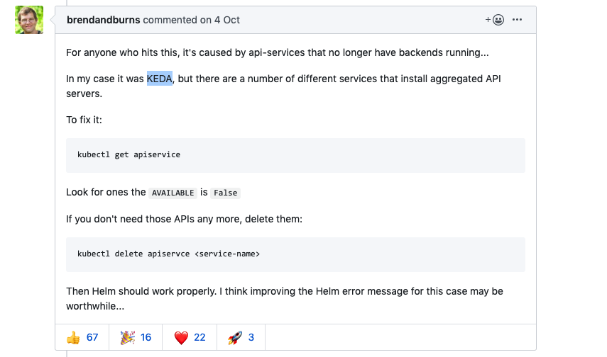

# Monitors on k8s

## Prerequests

- Kubernetes cluster
- Helm binary

## Steps

### step0

Get `prometheus` work on k8s’s node.

- Download referenced charts from [helm/charts](https://github.com/helm/charts).

- Customize your `prometheus` charts(`values.yml`):

```yaml
server:
	...
	service:
      ...
      servicePort: 9090
      nodePort: 30369
      sessionAffinity: None
      type: NodePort
```

This `NodePort` is  aimed to expose this service to public network for us to check if it is working.

- Install on k8s

```shell
helm install prometheus prometheus
```

### step1

Get `grafana` work on k8s.

- Customize `grafana` charts(`values.yml`):

```yaml
...
service:
  type: NodePort
  port: 80
  targetPort: 3000
  nodePort: 30368
```

- Install on k8s

```
helm install grafana grafana
```

### step2

Configure grafana using UI provided.

- Use command displayed after installing grafana to get password of `admin`.

```shell
kubectl get secret --namespace default grafana -o jsonpath="{.data.admin-password}" | base64 --decode ; echo
```

- Browser [grafana](202.120.40.8:30368) to set datasource of it.

  - get internal ip of prometheus:

  ```shell
  kubectl get services | grep prometheus-server
  ```

  - set url http://[internal-ip-of-prometheus-server]:9090 or http://prometheus-server:9090.

- Import 11074 to dashboard.

### step3

Change `prometheus` to be accessed only by internal ips.

- Modify `values.yml`:

```yaml
server:
	...
	service:
      ...
      servicePort: 9090
      # nodePort: 30369
      sessionAffinity: None
      type: ClusterIP
```

- Upgrade to k8s

```shell
helm upgrade prometheus prometheus
```

## Problems encountered

### helm installation error

```shell
Error: could not get apiVersions from Kubernetes: unable to retrieve the complete list of server APIs: metrics.k8s.io/v1beta1: the server is currently unable to handle the request
```

[Solution](https://github.com/helm/helm/issues/6361):



### helm delete 

If your service is half installed by helm and no release name exists, then you need to delete these pieces before install again.

- Use helm template and kubectl to delete rapidly.

```shell
helm template xxx ./ > t-xxx.yml
kubectl delete -f t-xxx.yml
```

- Next time when using helm to install, add `--atomic` flag.